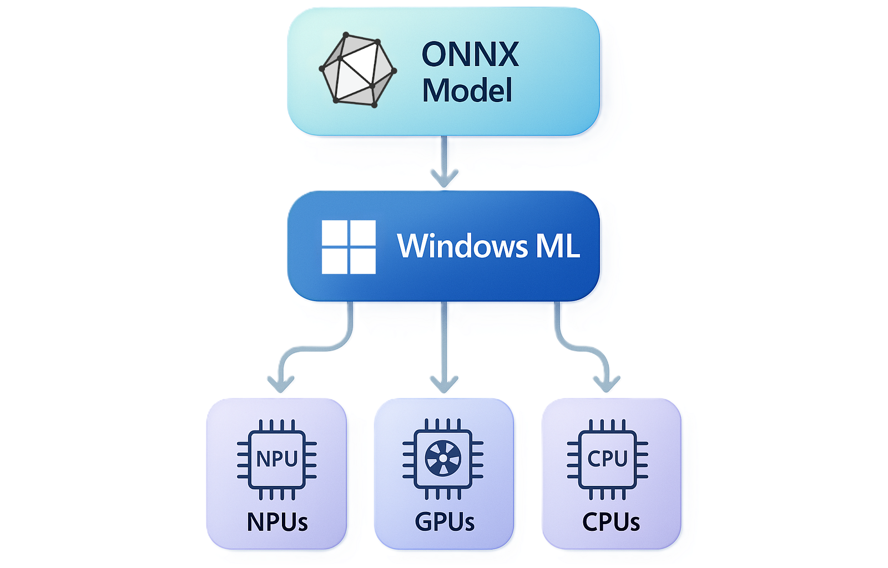
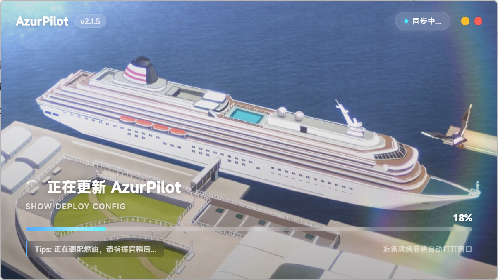
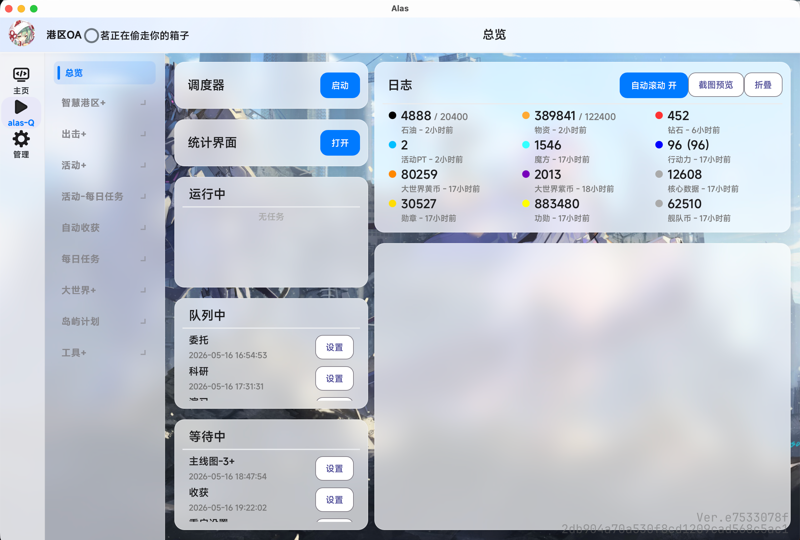

# AzurPilot — 碧蓝航线自动化辅助工具

<p align="center">
  <a href="README.md"></a>
  <a href="README.zh-TW.md"></a>
  <a href="README.en.md"></a>
  <a href="README.ja.md"></a>
  <a href="README.ko.md"></a>
</p>

<p align="center">
  
</p>

<p align="center">
  <strong><a href="https://alas.nanoda.work/">AzurPilot 官网</a></strong> ｜ 碧蓝航线自动化脚本 · 大世界侵蚀循环 · 多平台支持
</p>

<p align="center">
  <a href="https://deepwiki.com/wess09/AzurPilot">
    
  </a>
</p>

<p align="center">
  
  
  
  
  
</p>

<p align="center">
  
  
  
  
</p>

<p align="center">
  
  
  
</p>

<div align="center">
  <a href="https://alas.nanoda.work/">
    
  </a>
  &nbsp;&nbsp;&nbsp;&nbsp;
  <a href="https://addgroup.nanoda.work/#/">
    
  </a>
</div>

## 项目简介

AzurPilot 是基于 AzurLaneAutoScript 修改而来的碧蓝航线自动化辅助工具，保留原项目的核心能力，并在此基础上整合了多个分支、功能改进和实验性特性。通过 ADB/uiautomator2 控制安卓模拟器，以截图识别、图像匹配与 OCR 自动执行游戏任务，支持 CN/EN/JP/TW 四服。

> **请注意**：本项目代码基本由 AI 代码生成与辅助编写，存在较大的不确定性，欢迎提交 [Pull Request](https://github.com/wess09/AzurPilot/pulls) 改正。

访问 **[AzurPilot 官网](https://alas.nanoda.work/)** 了解更多功能详情，或前往 **[下载页面](https://alas.nanoda.work/download.html)** 获取最新版本。

## GUI 预览

<div align="center">
  
</div>

## 快速开始

> 💡 **推荐方式**：直接从 [AzurPilot 官网下载页](https://alas.nanoda.work/download.html) 下载对应平台的启动器，内置 Python 环境，开箱即用。

### Linux 一键部署

```shell
curl -fsSL https://alas.nanoda.work/install/deploy-image.sh | sudo -E bash
```

### 源码运行

本项目使用 `uv` 和项目根目录 `.venv` 管理 Python 运行环境（要求 Python >= 3.14）。发布版启动器会自带 uv、Python、ADB、Git，并在 `.venv` 中同步依赖；源码开发时可安装 uv 后运行：

```bash
uv sync --frozen --no-dev
uv run python gui.py
```

启动后浏览器访问 `http://127.0.0.1:25548` 进入 WebUI。

## 重要说明

- 本项目包含大量自动化逻辑和图像识别相关功能。使用前请确保已完成[游戏内设置](#使用前设置)，否则可能导致识别失败、流程异常或任务无法正常执行。
- 本项目包含部分实验性功能，可能存在未知问题。建议在使用前备份相关配置，并在发现异常时及时反馈。

## 使用前设置

使用前必须按照以下标准修改游戏内设置。

路径：主界面 → 右下角设置 → 左侧边栏选项。

| 设置名称 | 推荐值 |
| --- | --- |
| 帧数设置 | 60 帧 |
| 大型作战设置，减少 TB 引导 | 开 |
| 大型作战设置，自律时自动提交道具 | 开 |
| 大型作战设置，安全海域默认开启自律 | 关 |
| 剧情自动播放 | 开启 |
| 剧情自动播放速度调整 | 特快 |
| 待机模式设置，启用待机模式 | 关 |
| 其他设置，重复角色获得提示 | 关 |
| 其他设置，快速更换二次确认界面 | 关 |
| 其他设置，展示结算角色 | 关 |

### 大型作战设置

路径：大型作战 → 右上角雷达 → 指令模块 → 潜艇支援。

| 设置名称 | 推荐值 |
| --- | --- |
| X 消耗时潜艇出击 | 取消勾选 |

### 一键退役设置

路径：主界面 → 右下角建造 → 左侧边栏退役 → 左侧齿轮图标 → 一键退役设置。

| 设置名称 | 推荐值 |
| --- | --- |
| 选择优先级 1 | R |
| 选择优先级 2 | SR |
| 选择优先级 3 | N |
| 拥有满星的同名舰船时，保留几艘符合退役条件的同名舰船 | 不保留 |
| 没有满星的同名舰船时，保留几艘符合退役条件的同名舰船 | 满星所需或不保留 |

### 图像识别注意事项

请移除以下可能影响识别的内容：

- 角色设备装备
- 角色皮肤
- 可能遮挡界面元素的自定义显示内容

这些内容可能影响图像识别结果，导致自动化流程出现异常。

## MCP 服务

AzurPilot 提供 MCP 服务，可供支持 MCP 的客户端或工具调用，方便使用 Agent 管理 AzurPilot。

1. 岛屿计划自动化
2. 共斗沉船（牺牲指定位置舰船）
3. 大世界智能调度（自动切换侵蚀1练级与黄币补充任务）
4. 大世界蒙特卡洛模拟器（估算侵蚀循环收益）
5. 拆解装备箱（按保留数量拆白/蓝/紫箱）
6. 全新 OCR 模型
7. 共用心情（多个出击任务共享同一队心情）
8. 自定义任务优先级
9. 大世界舰队经验检测（满经验推送）
10. 侵蚀一舰队自动配队（自动更换满经验舰船）
11. 塞壬研究装置（紫币换黄币，探测资源/敌人）
12. 大世界海域成就（刷安全海域星星）
13. 定时重启模拟器
14. 远程SSH管理（执行命令如重启docker）
15. 大世界独立推送（与错误推送分离）
16. 维修箱修船（支持侵蚀1单独阈值）
17. 大世界信息推送开关（侵蚀1和短猫信息）
18. 白票商店购买战役信息记录仪/隐秘海域记录仪
19. 每月开荒进度显示
20. 演习推迟策略（至下次更新前X小时）
21. GUI仪表盘（实时显示石油、物资、魔方、大世界币等）
22. OOBE首次设置向导（选择语言、服务器、模拟器等）
23. 日志备份管理（保留数量、压缩备份）
24. LLM错误分析（调用大模型分析报错原因）
25. 游戏卡死或ADB离线时自动重启模拟器
26. 物资超过阈值停止出击
27. 道中战斗失败可撤退或换队接管
28. 困难图自动配队（使用推荐阵容）
29. 关卡名称支持“7-2-3”格式（三战后撤退）
30. 各商店独立开关（可单独关闭军火商、舰队商店等）
31. 硬件加速推理（Windows ML 自动选择可见 NPU/GPU / macOS ANE / ncnn Vulkan）
<p align="center">
  
</p>
32. OCR硬件加速选择（CPU / 硬件加速 / ANE，自动安装并注册 Windows ML 厂商 EP）
33. 共斗每日支持沉船模式


* 由 DeepSeek 结合项目分析生成 实际请以实物为准

## 多平台启动器

> 📥 从 [AzurPilot 官网](https://alas.nanoda.work/download.html) 下载 Windows / macOS / Linux 启动器

<div align="center">
  
  <p>启动加载界面</p>
  
  <p>Windows 客户端界面</p>
  
  <p>Mac 客户端界面</p>
</div>

启动器项目地：[GitHub](https://github.com/wess09/alas-launcher) · 源项目 [ALAS Launcher: 一种新型的 AzurLaneAutoScript 启动器](https://github.com/swordfeng/alas-launcher)

更改内容：

1. 增加托盘化功能
2. Windows 原生推送
3. GUI 样式美化
4. uv 化
...
-----END RSA PUBLIC KEY-----
```

#### 14. 运行项目

1. 检查是否处于 Ubuntu 的模拟 root 环境：
   - 如果使用 **CMD + SSH** 方式：手机处于 Termux 界面，需要登录到 Ubuntu：
     ```bash
     proot-distro login ubuntu
     ```
   - 如果使用 **Escrcpy + Termux** 方式：手机已经处于 Ubuntu，无需登录

2. 进入项目目录并运行：
   ```bash
   cd AzurPilot
   uv run python gui.py
   ```

3. 等待页面初始化完毕，浏览器提前打开 `http://手机IP:25548`
   - 出现 `success`
   - 出现 `0.0.0.0:25548`
   - 页面无报错
   - 浏览器出现初始化页面说明项目安装完成

#### 15. 配置模拟器设置

点击 **智慧港区 → 模拟器设置**，按以下配置：

| 配置项 | 值 | 说明 |
|---|---|---|
| 模拟器 Serial | `127.0.0.1:5555` | 端口换成真机的调试端口 |
| 模拟器截图方案 | `ADB_NC` | |
| 模拟器控制方案 | `ADB` | |
| 模拟器类型 | `SSH` | |
| 远程服务器地址 | 真机的 IP | 禁止填 `127.0.0.1` 或 `localhost`（指向 Ubuntu 内部） |
| 端口号 | `8022` | |
| 用户名 | Termux 的 `u0_xxxx` | |
| SSH 公钥 | Ubuntu 创建的公钥 | 不是演示公钥 |
| 远程启动指令 | 见下方 | |
| 远程停止指令 | 见下方 | |
| OCR 设备 | `CPU` | |

远程启动/停止指令（将 `40347` 改为自己的真机调试端口）：

```bash
# 远程启动指令
adb -s 127.0.0.1:40347 shell am start -n com.bilibili.azurlane/com.manjuu.azurlane.MainActivity

# 远程停止指令
adb -s 127.0.0.1:40347 shell am force-stop com.bilibili.azurlane
```

> **提示**：工具里的模拟器管理器与这里的配置是一致的。

#### 16. 调整分辨率

使用 CMD 窗口连接 SSH，调整手机分辨率：

```bash
adb shell wm size 720x1280
adb shell wm density 320   # 从 180-600 之间调整，直到屏幕效果满意
```

重置分辨率和像素比到默认值：

```bash
adb shell wm size reset
adb shell wm density reset
```

> 如果 `adb shell wm density reset` 无效，先执行 `adb shell wm density` 查看 `Physical density` 的初始值，再执行 `adb shell wm density <初始值>` 还原。

#### 17. 完成

启动**性能测试**和 **OCR 测试**，AP 会安装 ATX 和工具包来辅助控制碧蓝航线，过程中会有安装提示。

**到此所有调试完毕，可以正常设置 AP 并启动。**

## 重要说明

本项目包含大量自动化逻辑和图像识别相关功能。使用前请确保已经按照本文档完成游戏内设置，否则可能导致识别失败、流程异常或任务无法正常执行。

本项目包含部分实验性功能，可能存在未知问题。建议在使用前备份相关配置，并在发现异常时及时反馈。

## 使用前设置

使用前必须按照以下标准修改游戏内设置。

路径：

主界面，右下角设置，左侧边栏选项。

| 设置名称 | 推荐值 |
| --- | --- |
| 帧数设置 | 60 帧 |
| 大型作战设置，减少 TB 引导 | 开 |
| 大型作战设置，自律时自动提交道具 | 开 |
| 大型作战设置，安全海域默认开启自律 | 关 |
| 剧情自动播放 | 开启 |
| 剧情自动播放速度调整 | 特快 |
| 待机模式设置，启用待机模式 | 关 |
| 其他设置，重复角色获得提示 | 关 |
| 其他设置，快速更换二次确认界面 | 关 |
| 其他设置，展示结算角色 | 关 |

### 大型作战设置

路径：

大型作战，右上角雷达，指令模块，潜艇支援。

| 设置名称 | 推荐值 |
| --- | --- |
| X 消耗时潜艇出击 | 取消勾选 |

### 一键退役设置

路径：

主界面，右下角建造，左侧边栏退役，左侧齿轮图标，一键退役设置。

| 设置名称 | 推荐值 |
| --- | --- |
| 选择优先级 1 | R |
| 选择优先级 2 | SR |
| 选择优先级 3 | N |
| 拥有满星的同名舰船时，保留几艘符合退役条件的同名舰船 | 不保留 |
| 没有满星的同名舰船时，保留几艘符合退役条件的同名舰船 | 满星所需或不保留 |

### 图像识别注意事项

请移除以下可能影响识别的内容：

- 角色设备装备
- 角色皮肤
- 可能遮挡界面元素的自定义显示内容

这些内容可能影响图像识别结果，导致自动化流程出现异常。

## 主要改动

本分支在原项目基础上加入或整合了以下内容：

1. 智能调度
2. 大型作战限制解除相关功能
3. 侵蚀 1 相关功能
4. 部分未合并但实用的 Pull Request
5. 舰娘等级识别
6. 侵蚀 1 相关统计
7. 模拟器管理
8. Python 版本迁移
9. OCR 模型更换
10. GPU 加速推理支持
11. Alas MCP 服务
12. USB 采集卡截图与预览
13. 其他实验性改动与细节优化

## USB 采集卡截图

本分支支持通过 USB 采集卡获取游戏画面，可在 `Alas > Emulator > ScreenshotMethod` 中选择 `usb_capture`。

相关设置位于 `Alas > Emulator`：

- `UsbCaptureDevice`：OpenCV 设备编号或路径，例如 `0`、`1` 或 `/dev/video0`
- `UsbCaptureBackend`：OpenCV 视频后端，Windows 下通常使用 `auto` 或 `dshow`
- `UsbCaptureCodec`：采集编码，可在 `MJPG`、`YUY2`、`default` 之间切换
- `UsbCaptureWidth` / `UsbCaptureHeight` / `UsbCaptureFps`：请求采集卡使用的分辨率与帧率
- `UsbCaptureCAccel`：启用 USB 色彩校准的 Windows C 加速模块
- `UsbCaptureLockPreviewAspect`：锁定 USB 预览窗口画面比例，避免窗口拉伸导致画面变形

WebUI 中可单独启动或停止 USB 预览窗口。预览窗口支持鼠标点击、拖动、右键返回以及键盘输入，并通过 Alas 的控制逻辑发送到安卓设备。

辅助工具：

```bat
dev_tools\usb_capture_probe.bat
dev_tools\usb_capture_preview.bat
dev_tools\usb_capture_color_calibrate.bat "alas"
dev_tools\usb_capture_latency_benchmark.bat "alas" --count 50
```

如需使用 C 加速色彩校准，请先在 Windows 上构建：

```bat
dev_tools\build_usb_capture_lut_accel.bat
```

色彩校准文件会保存到 `config/usb_color/`。如果 USB 画面与 ADB 截图存在颜色差异，建议先运行色彩校准，再重启 USB 预览或截图服务。

## 多平台启动器

<div align="center">
  
  <p>启动加载界面</p>
  
  <p>Windows 客户端界面</p>
  
  <p>Mac 客户端界面</p>
</div>
启动器项目地：

[GitHub](https://github.com/wess09/alas-launcher) 源项目 [ALAS Launcher: 一种新型的 AzurLaneAutoScript 启动器](https://github.com/swordfeng/alas-launcher)

更改内容：
1. 增加托盘化功能
2. Windows原生推送
3. GUI样式美化
4. uv化

## MCP 服务

AzurPilot 提供 MCP 服务，可供支持 MCP 的客户端或工具调用。

通过 MCP 您可以方便的使用 Agent 管理 AzurPilot

### 本地连接配置

```json
{
  "mcpServers": {
    "alas": {
      "url": "http://127.0.0.1:22267/mcp/sse"
    }
  }
}
```

### 云服务器或内网连接配置

```json
{
  "mcpServers": {
    "alas": {
      "url": "http://[IP_ADDRESS]/mcp/sse"
    }
  }
}
```

请将 `[IP_ADDRESS]` 替换为实际服务器地址或内网地址。

## MCP 工具列表

当前可用 MCP 工具共 18 个。

### 实例管理

| 工具名称 | 功能 |
| --- | --- |
| list_instances | 列出所有实例 |
| get_status | 获取实例状态 |
| start_instance | 启动实例 |
| stop_instance | 停止实例 |

### 任务管理

| 工具名称 | 功能 |
| --- | --- |
| list_tasks | 列出所有任务 |
| get_task_help | 获取任务帮助 |
| trigger_task | 触发任务 |
| get_scheduler_queue | 获取调度队列 |
| clear_scheduler_queue | 清空调度队列 |

### 监控与信息

| 工具名称 | 功能 |
| --- | --- |
| get_current_running_task | 获取当前运行任务 |
| get_resources | 获取资源状态 |
| get_config | 获取实例配置 |
| get_recent_logs | 获取最近日志 |
| get_screenshot | 获取截图 |

### 配置管理

| 工具名称 | 功能 |
| --- | --- |
| update_config | 更新配置 |

### 维护工具

| 工具名称 | 功能 |
| --- | --- |
| restart_emulator | 重启模拟器 |
| restart_adb | 重启 ADB |
| update_alas | 更新 AzurPilot |

## 赞助支持

<p align="center">
  <a href="https://afdian.com/a/miaonaa">
    
  </a>
  <br>
  <b>支持本项目（用于支付服务器费用或训练新模型等）</b>
</p>

## 贡献者

由于本项目基于 AzurLaneAutoScript 及其社区分支继续开发，贡献者列表不仅包含本仓库的直接贡献者，也包含上游项目与相关分支中的原始贡献者。

*本项目的贡献名单

<a href="https://github.com/wess09/AzurPilot/graphs/contributors">
  
</a>

*启动器项目的贡献名单

<a href="https://github.com/wess09/alas-launcher/graphs/contributors">
  
</a>

*ALAS原项目的功能名单

<a href="https://github.com/LmeSzinc/AzurLaneAutoScript/graphs/contributors">
  
</a>

## 相关链接

- [AzurPilot 官网](https://alas.nanoda.work/) — 项目介绍、功能详情、碧蓝航线自动化方案
- [AzurPilot 下载页](https://alas.nanoda.work/download.html) — 下载 Windows / macOS / Linux 版本的碧蓝航线脚本工具
- [GitHub 仓库](https://github.com/wess09/AzurPilot) — 源码、Issue、Pull Request
- [QQ 交流群](https://join.nanoda.work/#/) — 碧蓝航线自动化社区交流
- [AzurLaneAutoScript 上游项目](https://github.com/LmeSzinc/AzurLaneAutoScript) — ALAS 原版
- [AzurPilot 树莓派版](https://github.com/nnieie/AzurPilot) — 面向树莓派 / Termux 真机的 AzurPilot CN 部署版

## 开发与贡献

本项目基本完全是 VibeCoding 产物，不足之处请见谅。欢迎通过 Issue 或 Pull Request 反馈问题、提交修复或改进文档。

### 开发环境

```bash
uv sync --frozen        # 创建/同步 .venv（含开发依赖）

# 代码检查（CI 使用 ruff 宽松设置——仅检查致命语法错误和未定义名称）
uv run ruff check . --select E9,F63,F7,F82 --ignore F821,F722

# 测试（约 160 个单元测试）
uv run python -m unittest discover -s tests

# 配置生成（修改配置 YAML 文件后必须执行）
uv run -m module.config.config_updater
```

### 使用过的开发工具与模型

本项目开发过程中使用过多种 AI 模型与开发工具进行辅助。

**AI 模型：**

| | | |
| --- | --- | --- |
| Gemini | GPT | Claude |
| GLM | MiMo | DeepSeek |
| Kimi | Qwen | DouBao |

**开发工具：**

| | | |
| --- | --- | --- |
| Claude Code | Codex | Cursor | Antigravity |
| TRAE | ZCode | OpenCode | MiMoCode |


## 许可证

本项目遵循原项目及相关上游项目的许可证要求。启动器项目遵循 GPL-3.0 协议开源。

本项目依赖的相关项目许可证位于 /licenses

使用、修改或分发本项目时，请同时遵守相关上游项目的许可证要求。

## 赞助支持

<p align="center">
  <a href="https://afdian.com/a/miaonaa">
    
  </a>
  <br>
  <b>支持本项目（用于支付服务器费用或训练新模型等？）</b>
</p>